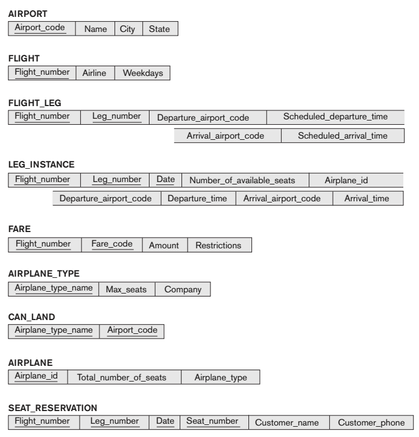
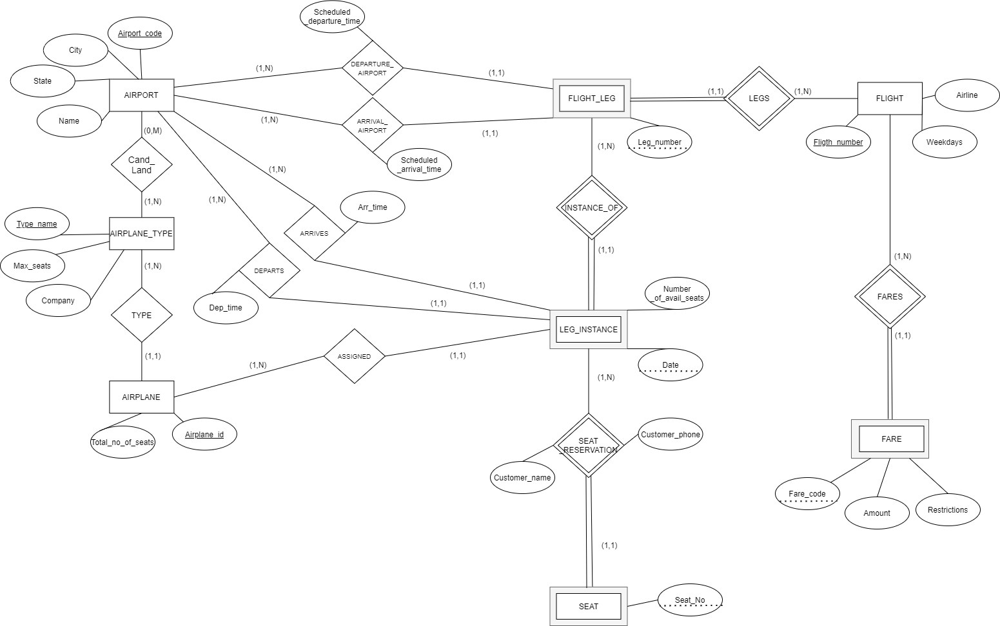
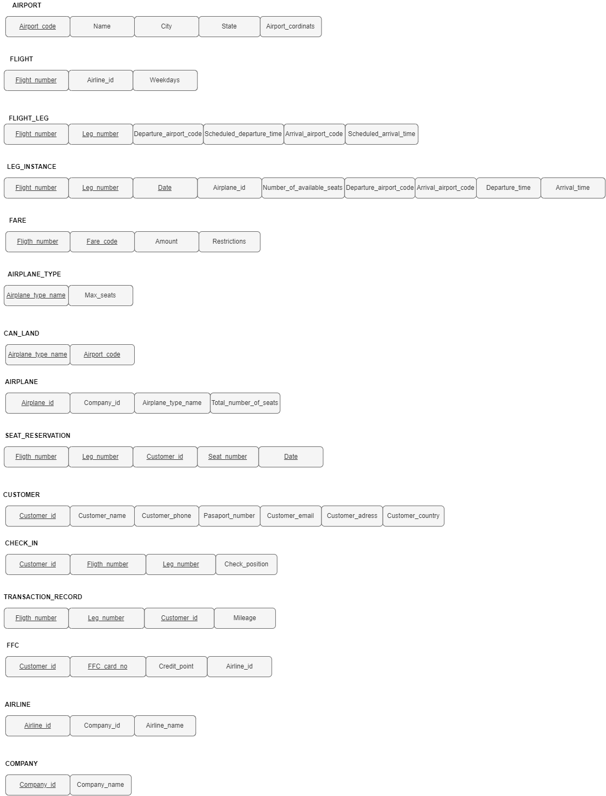
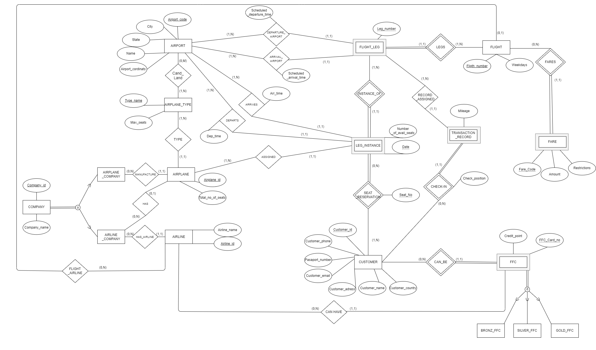

# Airline-Relational-DBManagement
In this project, we reverse engineered the given database design and expanded its conceptual design. After these design processes, we created it on Microsoft SQL.

#### *GIVEN SCHEMA*

### __EER diagram we created according to the given schema__

### Explanation of EER Diagram

In the diagram below,

- An AIRPLANE must have one AIRPLANE_TYPE, an AIRPLANE_TYPE can be the type of one or more AIRPLANE.
- An AIRPLANE_TYPE can land to one or more AIRPORT, an AIRPORT can be landed by zero or more AIRPLANE_TYPE.
- A FLIGHT can have zero (this FLIGHT can be made by a person) or more FARE ,a FARE must depend on one FLIGHT.
- A FLIGHT can have one or more FLIGHT_LEG, A FLIGHT_LEG must depend on one FLIGHT.
- A FLIGHT_LEG must have one DEPARTURE_AIRPORT and one ARRIVAL_AIRPORT, AIRPORT can be added by one or more FLIGHT_LEG.
- A FLIGHT_LEG can be instanced by one or more LEG_INSTANCE, LEG_INSTANCE must instance one FLIGHT_LEG.
- A LEG_INSTANCE can be made by one AIRPLANE, AIRPLANE can be assigned to one or more LEG_INSTANCE.
- A LEG_INSTANCE can have zero or more reservation.
- A SEAT must depend on one LEG_INSTANCE.

## Expanded Design

__SCHEMA__

__ERR Diagram__

### ERR Diagram Explanations

- COMPANY can be a AIRPLANE_COMPANY, AIRLANE_COMPANY or both of them.
- If this COMPANY is an AIRPLANE_COMPANY, it can manufacture zero or more AIRPLANE and an AIRPLANE must be manufactured by one AIRPLANE_COMPANY.
- If this COMPANY is an AIRLINE_COMPANY, it can have zero or more AIRPLANE and an AIRPLANE can be depended on zero (this AIRPLANE can be a private jet) or more AIRLINE_COMPANY.
- If this COMPANY is an AIRLINE, it can have zero or more AIRLINE and an AIRLINE must be depended on an AIRLINE_COMPANY.
- An AIRPLANE must have one AIRPLANE_TYPE, an AIRPLANE_TYPE can be the type of one or more AIRPLANE.
- An AIRPLANE_TYPE can land to one or more AIRPORT, an AIRPORT can be landed by zero or more AIRPLANE_TYPE.
- An AIRLINE can have zero or more FLIGHT, FLIGHT can have zero (this FLIGHT can be made by a person) or one AIRLINE.
- A FLIGHT can have zero (this FLIGHT can be made by a person) or more FARE ,a FARE must depend on one FLIGHT.
- A FLIGHT can have one or more FLIGHT_LEG, A FLIGHT_LEG must depend on one FLIGHT.
- A FLIGHT_LEG must have one DEPARTURE_AIRPORT and one ARRIVAL_AIRPORT, AIRPORT can be added by one or more FLIGHT_LEG.
- A FLIGHT_LEG can be instanced by one or more LEG_INSTANCE, LEG_INSTANCE must instance one FLIGHT_LEG.
- A FLIGHT_LEG can hold one or more TRANSACTION_RECORD, a TRANSACTION_RECORD can assigned to one FLIGHT_LEG.
- A TRANSACTION_RECORD can be created by one CUSTOMER when this CUSTOMER physically check-in and a CUSTOMER can create one or more TRANSACTION_RECORD.
- A LEG_INSTANCE can be made by one AIRPLANE, AIRPLANE can be assigned to one or more LEG_INSTANCE.
- A LEG_INSTANCE’s seat can be made reservation by zero (this FLIGHT can be made by a person) or more customer, CUSTOMER can make reservation to one or more LEG_INSTANCE.
- A CUSTOMER can be one or more (for different companies) Frequently Flyer Customer, a FFC must be a CUSTOMER.
- A FFC must be depended on an AIRLINE, an AIRLINE can have zero or more FFC.
- A FFC can be a BRONZ_FFC, SILVER_FFC or GOLD_FFC.

### New Requirements

COMPANY: We added two different types for company entity. AIRPLANE_COMPANY is manufacturer company of an AIRPLANE.AIRLINE_COMPANY is that has AIRLINE and AIRPLANES. 
For example: THY and AnadoluJet are two different AIRLINE but THY COMPANY is owner of AnadoluJet. In this example we presume that THY COMPANY has AnadoluJet and THY airlines.

FFC: We create FFC entity according to total mileages of Customer. 
There are 3 different FFC types. These are BRONZ_FFC, SILVER_FFC and GOLD_FFC. We differ customer according to FFC’s Credit_point.

TRANSACTION_RECORD: If a customer check-in, it creates a transaction record with the mileage information assigned to that flight leg. 
We calculate milage from the Airport_cordinates attribute that is placed at AIRPORT entity.

### Specialization/Generalization

COMPANY entity type is a superclass to two different subclasses:AIRLINE_COMPANY and AIRPLANE_COMPANY. This
specialization is overlapping, meaning a COMPANY can be one of them or both of them.

FFC entity type is a superclass to three different subclasses: BRONZ_FFC, SILVER_FFC and GOLD_FFC. This specialization is disjoint, meaning a FFC can be only one type FFC type.

### Classifications

Strong Entities:

- FLIGHT
- CUSTOMER
- AIRPORT
- AIRLINE
- AIRPLANE_TYPE
- COMPANY

WEAK ENTITIES:

- FFC
- FLIGHT_LEG
- FARE
- TRANSCATION_RECORD
- LEG_INSTANCE

RELATIONSHIPS:

- MANUFACTURE
- HAS
- HAS_AIRLINE
- FLIGHT_AIRLINE
- TYPE
- CAND_LAND
- DEPARTURE_AIRPORT
- ARRIVAL_AIRPORT
- CAN_HAVE
- ASSIGNED
- DEPARTS
- ARRIVES

IDENTIFICATION RELATIONSHIPS:

- LEGS
- FARES
- INSTANCE_OF
- SEAT_RESERVATION
- CHECK-IN
- CAN_BE

### Semantic Constraints

- Seat reservation count of a LEG_INSTANCE must be less than or equal to count of total seat number of plane.
- Customer count of a LEG_INSTANCE must be less than or equal to count of total seat number of plane.
- Before a AIRPLANE lands, it cannot take off.
- FFC count must be less than or equal to count of CUSTOMER.
- If landing is forced landing, a AIRPLANE can land to unspecified airport.
- A CUSTOMER cannot check-in for more than one FLIGHT at the same time.

#### Details that will affect the eventual design

- A CUSTOMER has to check in 60 minutes before departure.
- Kids between 2-12 can’t fly without parent.
- Kids over 2 years old must buy a ticket.
- A CUSTOMER cannot get on the plane without payment,reservation or check-in.
- A CUSTOMER cannot make reservation to a SEAT that had been made
reservation by another CUSTOMER.
- For some reasons, flights can be cancelled or postponed.

### Implementing With SQL Server

We used MicrosoftSQL server for this project. There is SQL Queries in /SQL file. When it will be implemented, first the Tables.sql and then the triggers in Triggers.sql one by one. Optionally, the data in SampleDatas.sql can be used. Other queries were performed for controls.

__PS: Project members are Yusuf Bulut, Cem Sertkaya & Deniz Durmuş__
